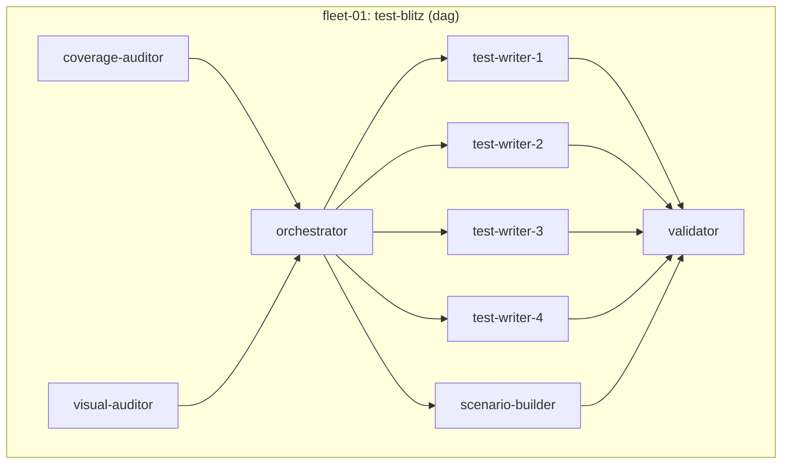
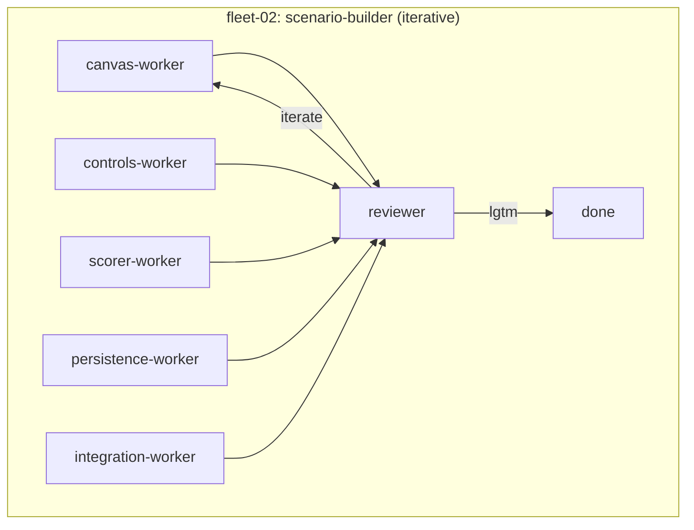
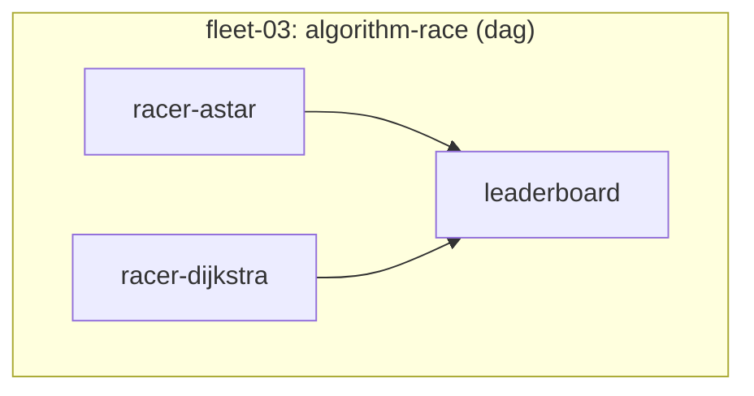
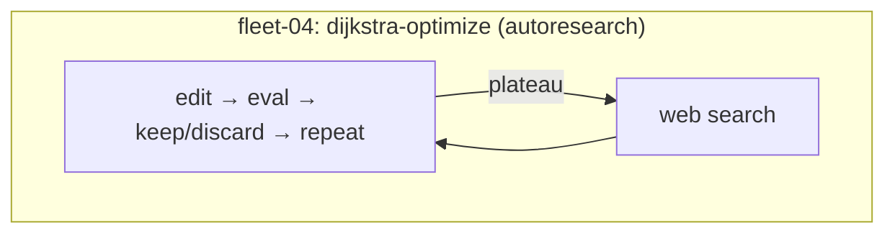

# Getting Started — Fleet Demo

Step-by-step guide to run parallel AI fleets against this codebase.

## Prerequisites

### 1. Node.js (v18+)

```bash
# Check if installed
node --version

# Install via nvm (recommended)
curl -o- https://raw.githubusercontent.com/nvm-sh/nvm/v0.40.3/install.sh | bash
nvm install 22
```

### 2. tmux

Fleets run workers in tmux sessions. Required.

**Linux (Ubuntu/Debian):**
```bash
sudo apt update && sudo apt install -y tmux
```

**Linux (Fedora/RHEL):**
```bash
sudo dnf install -y tmux
```

**macOS:**
```bash
brew install tmux
```

Verify: `tmux -V`

### 3. Claude Code

```bash
npm install -g @anthropic-ai/claude-code
```

Verify: `claude --version`

### 4. Install fleet skills

From inside this repo:

```bash
npx skills add quickcall-dev/skills
```

When prompted:
- **Skills**: select all (or pick specific fleets you want)
- **Agents**: select **Claude Code**
- **Scope**: **Project**
- **Method**: **Symlink**

Verify skills loaded — start a new Claude Code session and check `/dag-fleet` appears in the skill list.

## Setup

### Clone and install

```bash
git clone <this-repo-url> && cd <repo-name>
npm install
```

### Start dev environment

```bash
./dev.sh
```

This launches a tmux session (`pathfinding-dev`) with:
- **server** window: visual demo on `http://localhost:8080`
- **tests** window: runs the test suite

Keep this running. Fleet workers need the dev server for visual testing.

### Verify everything works

In the tests window, you should see all tests passing:

```
  ✓ should find path on empty grid
  ✓ should find path with obstacles
  ...
  X passing
```

## Launch a fleet

Open Claude Code **in a separate terminal** (not inside the dev tmux):

```bash
cd <repo-root>
claude
```

Then pick a fleet:

```
# Easiest — 3 workers, fast
/dag-fleet launch fleets/fleet-03-algorithm-race

# Medium — 9 workers, DAG dependencies
/dag-fleet launch fleets/fleet-01-test-blitz

# Advanced — iterative with reviewer loop
/iterative-fleet launch fleets/fleet-02-scenario-builder

# Autonomous — runs until stopped or budget exhausted
/autoresearch-fleet launch fleets/fleet-04-dijkstra-optimize
```

## Monitor a running fleet

```bash
# Status table (worker states, durations)
/<fleet-type> status

# Live tmux pane view of all workers
/<fleet-type> view

# Summary report
/<fleet-type> report
```

## Fleet overview









## Recommended order for first-time users

1. **fleet-03** (algorithm-race) — simplest, 3 workers, finishes fast
2. **fleet-01** (test-blitz) — shows DAG dependencies in action
3. **fleet-02** (scenario-builder) — shows iterative reviewer loop
4. **fleet-04** (dijkstra-optimize) — autonomous research, runs indefinitely

## Troubleshooting

| Problem | Fix |
|---------|-----|
| `skills not found` | Restart Claude Code after installing skills |
| `tmux: command not found` | Install tmux (see prerequisites) |
| `port 8080 in use` | `fuser -k 8080/tcp` (Linux) or `lsof -ti:8080 \| xargs kill` (macOS) |
| Workers stuck on "waiting" | Check DAG — upstream workers must complete first |
| Tests fail on install | Make sure you're on Node 18+ (`node --version`) |
| `npx skills` hangs | Check internet connection, skills installs from GitHub |

## Cost estimates

Based on prior runs with Claude models:

| Fleet | Approximate cost |
|-------|-----------------|
| fleet-01 (test-blitz) | ~$6 |
| fleet-02 (scenario-builder) | ~$2 |
| fleet-03 (algorithm-race) | ~$3 |
| fleet-04 (dijkstra-optimize) | ~$5-50 (depends on iterations) |

Costs vary by model choice and worker budget caps. See `fleet.json` for per-worker `max_budget_usd` settings.
