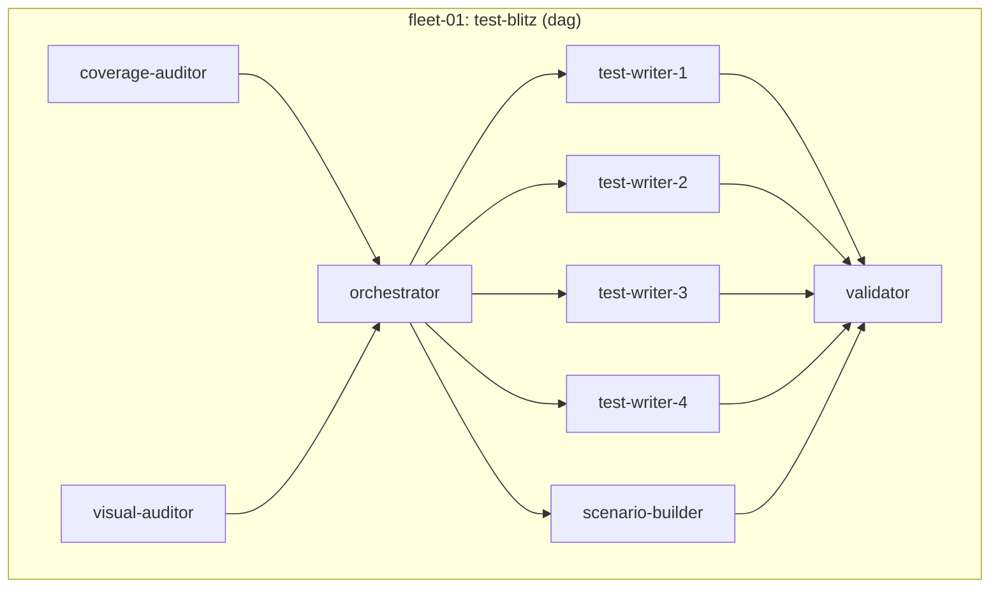
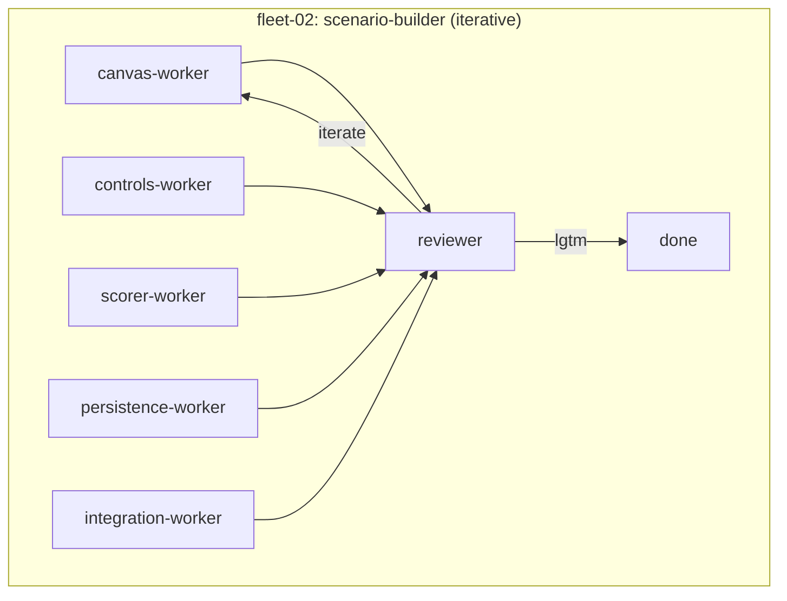
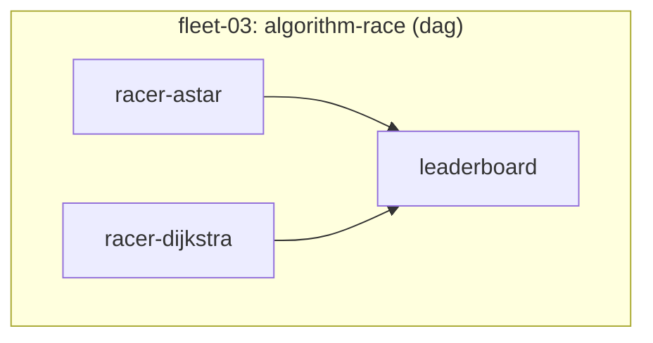
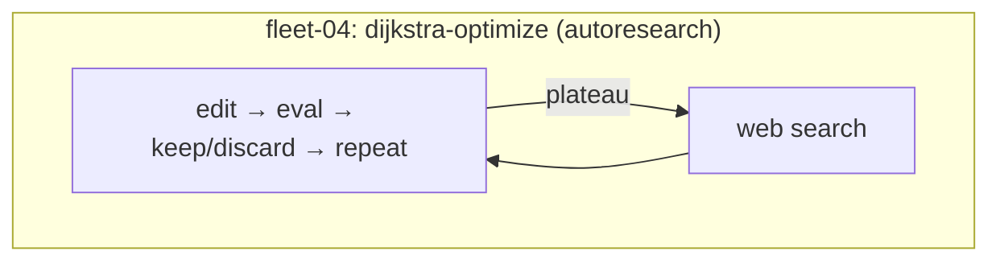

# PathFinding.js — Fleet Demo Template

Pre-configured repo for running [skills fleet demos](https://github.com/quickcall-dev/skills) against a real JavaScript codebase.

**Slides**: https://def1-20-124-190-109.ngrok-free.app/ *(temporary ngrok link)*

## Provenance

- **Upstream**: [qiao/PathFinding.js](https://github.com/qiao/PathFinding.js) — comprehensive pathfinding library for grid-based games
- **Fork point**: commit `2904a9a` (latest upstream as of 2026-04-15)
- **Patch applied**: `should.js` upgraded from `4.3.x` to `^13.2.3` for Node 25 compatibility

The codebase is untouched upstream code — no fleet-generated modifications included.

## Prerequisites

### 1. Node.js (v18+)

```bash
node --version
# or install via nvm
curl -o- https://raw.githubusercontent.com/nvm-sh/nvm/v0.40.3/install.sh | bash
nvm install 22
```

### 2. tmux

Fleets run workers in tmux sessions. Required.

- Ubuntu/Debian: `sudo apt install -y tmux`
- Fedora/RHEL: `sudo dnf install -y tmux`
- macOS: `brew install tmux`

Verify: `tmux -V`

### 3. Claude Code

```bash
npm install -g @anthropic-ai/claude-code
```

Verify: `claude --version`

### 4. Install fleet skills

From inside this repo:

```bash
npx skills add quickcall-dev/skills
```

When prompted:
- **Skills**: select all (or pick specific fleets you want)
- **Agents**: select **Claude Code**
- **Scope**: **Project**
- **Method**: **Symlink**

Verify skills loaded — start a new Claude Code session and check `/dag-fleet` appears in the skill list.

## Setup

```bash
git clone <this-repo-url> && cd <repo-name>
npm install
```

### Start dev environment

```bash
./dev.sh
```

Launches a tmux session (`pathfinding-dev`) with:
- **server** window: visual demo on `http://localhost:8080`
- **tests** window: runs the test suite

Keep this running. Fleet workers need the dev server for visual testing.

### Verify

Tests window should show all tests passing.

## Fleet Definitions

Four ready-to-launch fleets in `docs/experiments/002-live-demo/fleets/`:

| Fleet | Type | Workers | What it does |
|-------|------|---------|-------------|
| `fleet-01-test-blitz` | dag | 9 | Coverage audit → distribute → parallel test writing → validation |
| `fleet-02-scenario-builder` | iterative | 6 | Build interactive scenario builder with reviewer loop |
| `fleet-03-algorithm-race` | dag | 3 | Benchmark A* vs Dijkstra on identical maps, compile leaderboard |
| `fleet-04-dijkstra-optimize` | autoresearch | 1 | Autonomous loop: optimize Dijkstra to close gap with A* |

## Launch a fleet

Open Claude Code **in a separate terminal** (not inside the dev tmux):

```bash
cd <repo-root>
claude
```

Then pick a fleet:

```
# Easiest — 3 workers, fast
/dag-fleet launch docs/experiments/002-live-demo/fleets/fleet-03-algorithm-race

# Medium — 9 workers, DAG dependencies
/dag-fleet launch docs/experiments/002-live-demo/fleets/fleet-01-test-blitz

# Advanced — iterative with reviewer loop
/iterative-fleet launch docs/experiments/002-live-demo/fleets/fleet-02-scenario-builder

# Autonomous — runs until stopped or budget exhausted
/autoresearch-fleet launch docs/experiments/002-live-demo/fleets/fleet-04-dijkstra-optimize
```

## Monitor

```bash
/<fleet-type> status    # worker states, durations
/<fleet-type> view      # live tmux pane view
/<fleet-type> report    # summary report
```

## Fleet structure diagrams









## Recommended order for first-time users

1. **fleet-03** (algorithm-race) — simplest, 3 workers, finishes fast
2. **fleet-01** (test-blitz) — shows DAG dependencies in action
3. **fleet-02** (scenario-builder) — shows iterative reviewer loop
4. **fleet-04** (dijkstra-optimize) — autonomous research, runs indefinitely

## Documentation skill (`/doc`)

This repo comes with a pre-initialized `docs/` structure managed by the `/doc` skill. As you run fleets, use `/doc` to track plans, findings, checkpoints, and learnings — all organized under numbered experiments.

```
docs/experiments/002-live-demo/
├── .meta.json           # auto-managed metadata
├── fleets/              # fleet definitions (ready to launch)
├── plans/               # numbered plans (01, 02, ...)
├── findings/            # discoveries during work
├── checkpoints/         # progress snapshots
├── research/            # experiment-scoped research
└── review/              # structured reviews
```

### Quick reference

```bash
# Inside Claude Code:
/doc plan 2 "test-strategy"
/doc ckpt 2 "tests-passing"
/doc finding 2 "perf-regression"
/doc learn 2 "testing" "mock-pitfalls"
/doc status 2
/doc list
/doc resume 2
```

Stateless and parallel-safe — multiple fleet workers can write to the same experiment without conflicts.

## Repo structure

```
├── src/                 # pathfinding library source
│   ├── core/            # Grid, Node, Heap, Util
│   └── finders/         # A*, Dijkstra, BFS, JumpPoint, etc.
├── test/                # mocha test suite
├── visual/              # browser demo app
├── dev.sh               # tmux dev environment launcher
└── docs/
    └── experiments/
        └── 002-live-demo/
            └── fleets/
                ├── fleet-01-test-blitz/
                ├── fleet-02-scenario-builder/
                ├── fleet-03-algorithm-race/
                └── fleet-04-dijkstra-optimize/
```

## Dev commands

```bash
npm install
npx mocha --require should test/**/*.js    # run tests
npx http-server visual -p 8080 -c-1         # start visual demo
```

## Troubleshooting

| Problem | Fix |
|---------|-----|
| `skills not found` | Restart Claude Code after installing skills |
| `tmux: command not found` | Install tmux (see prerequisites) |
| `port 8080 in use` | `fuser -k 8080/tcp` (Linux) or `lsof -ti:8080 \| xargs kill` (macOS) |
| Workers stuck on "waiting" | Check DAG — upstream workers must complete first |
| Tests fail on install | Make sure you're on Node 18+ (`node --version`) |
| `npx skills` hangs | Check internet connection, skills installs from GitHub |

## Cost estimates

Based on prior runs with Claude models:

| Fleet | Approximate cost |
|-------|-----------------|
| fleet-01 (test-blitz) | ~$6 |
| fleet-02 (scenario-builder) | ~$2 |
| fleet-03 (algorithm-race) | ~$3 |
| fleet-04 (dijkstra-optimize) | ~$5-50 (depends on iterations) |

Costs vary by model choice and worker budget caps. See `fleet.json` for per-worker `max_budget_usd` settings.

## Original library

PathFinding.js provides 10 pathfinding algorithms for 2D grids: A*, Dijkstra, BFS, BestFirst, JumpPoint, IDA*, and their bi-directional variants. See the [online demo](http://qiao.github.io/PathFinding.js/visual).

MIT License — Xueqiao Xu
