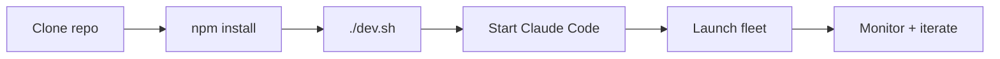

## What

- 4 fleet definitions ready to launch, inside `docs/experiments/001-demo-artifacts/fleets/`
- All runtime state stripped (no status, session_name, timestamps)
- Absolute paths replaced with relative paths in all prompt.md files
- Dev environment via `./dev.sh` (tmux: server + tests)
- `/doc` skill scaffold pre-initialized

## Fleet launch commands

```bash
# Start simple — 3 workers, fast finish
/dag-fleet launch docs/experiments/001-demo-artifacts/fleets/fleet-03-algorithm-race

# 9-worker DAG with dependency chain
/dag-fleet launch docs/experiments/001-demo-artifacts/fleets/fleet-01-test-blitz

# Iterative with reviewer loop
/iterative-fleet launch docs/experiments/001-demo-artifacts/fleets/fleet-02-scenario-builder

# Autonomous research — runs until killed
/autoresearch-fleet launch docs/experiments/001-demo-artifacts/fleets/fleet-04-dijkstra-optimize
```

## Issues

- None. All definitions validated against original successful runs.

## Decisions

- Fleets live inside experiment dir, not repo root — shows `/doc` skill structure
- Recommended order: fleet-03 → fleet-01 → fleet-02 → fleet-04 (simple to complex)
- `bench-dijkstra.js` lives at repo root (fleet-04 eval command expects it there)

## Next

1. Launch fleet-03 (algorithm-race) as smoke test
2. Verify workers spawn, run, and complete
3. Check outputs land in correct worker dirs
4. Create checkpoint 02 after first successful fleet run
