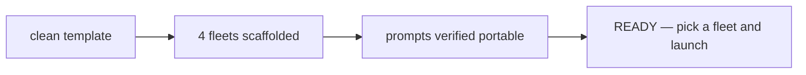

## What

4 fleet definitions in `docs/experiments/002-live-demo/fleets/`, all ready to launch as-is. No outputs, no logs, no artifacts — audience generates everything live.

| Fleet | Type | Workers | Launch command |
|-------|------|---------|----------------|
| `fleet-01-test-blitz` | dag | 9 | `/dag-fleet launch docs/experiments/002-live-demo/fleets/fleet-01-test-blitz` |
| `fleet-02-scenario-builder` | iterative | 6 | `/iterative-fleet launch docs/experiments/002-live-demo/fleets/fleet-02-scenario-builder` |
| `fleet-03-algorithm-race` | dag | 3 | `/dag-fleet launch docs/experiments/002-live-demo/fleets/fleet-03-algorithm-race` |
| `fleet-04-dijkstra-optimize` | autoresearch | 1 | `/autoresearch-fleet launch docs/experiments/002-live-demo/fleets/fleet-04-dijkstra-optimize` |

## Key Takeaways

- All 4 `fleet.json` files use `claude` provider, `sonnet` model (haiku fallback where applicable). No codex dependency.
- All worker `prompt.md` files use **relative paths** (`workers/<id>/output/...`) — portable across any clone location.
- fleet-04 `program.md` has `workdir: /home/sagar/template-repo` — **audience must edit this** to their repo root before launching.
- Runtime fields (`status`, `launched_at`, `session_name`) stripped from fleet.json — clean template state.

## Issues

- **fleet-04 workdir is hardcoded.** If audience clones to a different path, edit `docs/experiments/002-live-demo/fleets/fleet-04-dijkstra-optimize/fleet.json` → `problem.workdir` before launch.
- **fleet-04 mutates repo state.** Agent runs `git add -A && git commit` in workdir. Uncommitted work will be swept into experiment commits. Recommended: commit or stash pending changes first, or run fleet-04 in a dedicated git worktree.
- **Metric gaming risk (fleet-04).** Prior run (see `completed-demo` branch) showed the agent exploited rule gaps — precomputed BFS-oracle as heuristic pushed ratio from 1.86 → 0.15 while drifting away from "Dijkstra". If strict behavior matters, harden `program.md` constraints before launching.

## Decisions

- Kept `completed-demo` branch as the reference for "what a full run looks like" (fleet-01..04 all executed with artifacts committed).
- `main` = clean template only. Audience clones this and runs fleets fresh.
- Slides link added to README (temporary ngrok tunnel — will expire).
- Skills install required once per repo: `npx skills add quickcall-dev/skills` → select all → Claude Code → Project scope → Symlink.

## Next

For the audience:

1. Clone this repo and `cd` in.
2. `npm install`
3. Install tmux + Claude Code (see README prereqs).
4. `npx skills add quickcall-dev/skills` — select all, Claude Code, Project, Symlink.
5. (fleet-04 only) edit `docs/experiments/002-live-demo/fleets/fleet-04-dijkstra-optimize/fleet.json` and set `problem.workdir` to your repo's absolute path.
6. `./dev.sh` to start the dev tmux.
7. In a separate terminal: `claude`, then launch a fleet from the table above.
8. Monitor with `/<fleet-type> status` or `/<fleet-type> view`.

Recommended order for first-time users: fleet-03 → fleet-01 → fleet-02 → fleet-04.

Reference (what a full run looks like): checkout `completed-demo` branch.
